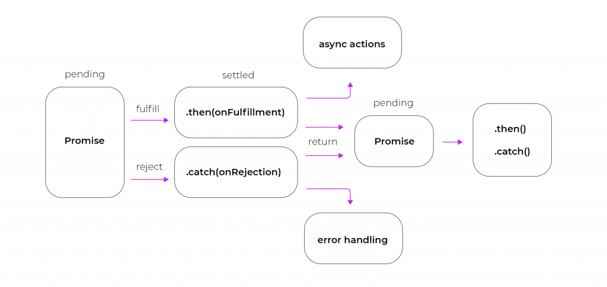

# Understanding Promises in JavaScript

Promises are a fundamental part of asynchronous programming in JavaScript. They provide a way to work with asynchronous operations in a more organized and manageable manner. In this guide, we'll explore the concept of Promises, how to create and use them, and advanced Promise-related methods.



## Table of Contents

1. [Introduction to Promises](#introduction-to-promises)
2. [Creating Promises](#creating-promises)
3. [Basic Promise Usage](#basic-promise-usage)
4. [Promise States](#promise-states)
5. [Promise Methods](#promise-methods)
    - [Promise.resolve(value)](#promiseresolvevalue) (Class Method)
    - [Promise.reject(reason)](#promiserejectreason) (Class Method)
    - [Promise.all(iterable)](#promisealliterable) (Static Method)
    - [Promise.race(iterable)](#promiseraceiterable) (Static Method)
    - [Promise.any(iterable)](#promiseanyiterable) (Static Method)
    - [.then(onFulfilled, onRejected)](#thenonfulfilled-onrejected) (Prototypal Method)
    - [.catch(onRejected)](#catchonrejected) (Prototypal Method)
    - [.finally(onFinally)](#finallyonfinally) (Prototypal Method)
    - [Promise.allSettled(iterable)](#promiseallsettlediterable) (Static Method)
6. [Chaining Promises](#chaining-promises)
7. [Error Handling with Promises](#error-handling-with-promises)
8. [Promisifying Callbacks](#promisifying-callbacks)
9. [Async/Await with Promises](#asyncawait-with-promises)
10. [Real-World Examples](#real-world-examples)
11. [Conclusion](#conclusion)

## Introduction to Promises

A Promise in JavaScript represents a value that may not be available yet but will be at some point in the future. It's a container for a future value, and it provides a standardized way to work with asynchronous code.

Promises are commonly used for tasks like fetching data from a server, reading files, making network requests, and other operations that may take time to complete.

### Example: Creating a Simple Promise

You can create a Promise using the `Promise` constructor. It takes a single function (commonly called the "executor function") as an argument. This function receives two parameters: `resolve` and `reject`. `resolve` is used to fulfill the Promise with a value, and `reject` is used to reject the Promise with an error.

```javascript
const myPromise = new Promise((resolve, reject) => {
    // Simulate an asynchronous operation.
    setTimeout(() => {
        // Fulfill the Promise with a value.
        resolve('Success');
    }, 1000);
});
```

## Basic Promise Usage

Once a Promise is created, you can use the `.then()` method to specify what should happen when the Promise is fulfilled (resolved) and the `.catch()` method to handle any errors.

### Example: Basic Promise Usage

```javascript
myPromise
    .then((result) => {
        // Handle the fulfillment (success) of the Promise.
        console.log('Promise resolved with result:', result);
    })
    .catch((error) => {
        // Handle the rejection (error) of the Promise.
        console.error('Promise rejected with error:', error);
    });
```

## Promise States

Promises can be in one of three states:

-   **Pending:** The initial state, neither fulfilled nor rejected.
-   **Fulfilled:** The Promise has been resolved with a value.
-   **Rejected:** The Promise has been rejected with an error.

### Example: Checking Promise State

```javascript
switch (myPromise) {
    case 'pending':
        console.log('Promise is pending');
        break;
    case 'fulfilled':
        console.log('Promise is fulfilled');
        break;
    case 'rejected':
        console.log('Promise is rejected');
        break;
    default:
        console.log('Unknown Promise state');
}
```

Once a Promise transitions to either the fulfilled or rejected state, it becomes "settled."

## Promise Methods

### `Promise.resolve(value)` (Class Method)

The `Promise.resolve` method creates a new Promise that is resolved with the given `value`. If the `value` is a thenable (an object with a `then` method, like another Promise), it adopts the state of that thenable.

### Example: Using `Promise.resolve`

```javascript
const resolvedPromise = Promise.resolve('Resolved Value');
resolvedPromise.then((value) => {
    console.log('Resolved Promise:', value);
});
```

### `Promise.reject(reason)` (Class Method)

The `Promise.reject` method creates a new Promise that is rejected with the given `reason`. The `reason` is typically an error message or an error object.

### Example: Using `Promise.reject`

```javascript
const rejectedPromise = Promise.reject('Rejected Reason');
rejectedPromise.catch((reason) => {
    console.error('Rejected Promise:', reason);
});
```

### `Promise.all(iterable)` (Static Method)

The `Promise.all` method takes an iterable (e.g., an array of Promises) and returns a new Promise that resolves when all Promises in the iterable have resolved successfully. If any Promise in the iterable is rejected, the resulting Promise is also rejected.

### Example: Using `Promise.all`

```javascript
const promise1 = Promise.resolve('One');
const promise2 = Promise.resolve('Two');
const promise3 = Promise.reject('Three');

Promise.all([promise1, promise2, promise3])
    .then((results) => {
        // Handle the fulfillment of all Promises.
        console.log('All Promises fulfilled:', results);
    })
    .catch((error) => {
        // Handle the first rejection encountered.
        console.error('At least one Promise rejected:', error);
    });
```

### `Promise.race(iterable)` (Static Method)

The `Promise.race` method returns a new Promise that resolves or rejects as soon as one of the Promises in the iterable resolves or rejects. It's often used for implementing timeouts or racing multiple asynchronous operations.

### Example: Using `Promise.race`

```javascript
const promise1 = new Promise((resolve) => setTimeout(resolve, 1000, 'One'));
const promise2 = new Promise((resolve) => setTimeout(resolve, 500, 'Two'));

Promise.race([promise1, promise2]).then((result) => {
    // Handle the result of the first settled Promise.
    console.log('First Promise to settle:', result);
});
```

### `Promise.any(iterable)` (Static Method)

The `Promise.any` method returns a Promise that resolves when at least one Promise in the iterable resolves successfully. If all Promises are rejected, the resulting Promise is rejected with an `AggregateError` containing the rejection reasons.

### Example: Using `Promise.any`

```javascript
const promise1 = Promise.reject('One');
const promise2 = new Promise((resolve) => setTimeout(resolve, 500, 'Two'));

Promise.any([promise1, promise2])
    .then((result) => {
        // Handle

 the result of the first fulfilled Promise.
        console.log('First Promise to fulfill:', result);
    });

// Expected Output:
// First Promise to fulfill: Two
```

### `.then(onFulfilled, onRejected)` (Prototypal Method)

The `then` method is used to specify what should happen when a Promise is fulfilled (successfully resolved) or rejected (encounters an error). It takes two callback functions: `onFulfilled` is called when the Promise is fulfilled, and `onRejected` is called when it's rejected.

### Example: Using `.then` for Fulfillment and Rejection

```javascript
myPromise
    .then((result) => {
        // Handle the fulfillment (success) of the Promise.
        console.log('Promise resolved with result:', result);
    })
    .catch((error) => {
        // Handle the rejection (error) of the Promise.
        console.error('Promise rejected with error:', error);
    });
```

### `.catch(onRejected)` (Prototypal Method)

The `catch` method is a shorthand for handling Promise rejections. It's equivalent to calling `.then(undefined, onRejected)` and is used to specify what should happen when a Promise is rejected.

### Example: Using `.catch`

```javascript
myPromise
    .then((result) => {
        // Handle the fulfillment (success) of the Promise.
        console.log('Promise resolved with result:', result);
    })
    .catch((error) => {
        // Handle the rejection (error) of the Promise.
        console.error('Promise rejected with error:', error);
    });
```

### `.finally(onFinally)` (Prototypal Method)

The `finally` method allows you to specify a callback function (`onFinally`) that will be executed regardless of whether the Promise is fulfilled or rejected. It's commonly used for cleanup or resource release operations.

### Example: Using `.finally`

```javascript
myPromise
    .then((result) => {
        // Handle the fulfillment (success) of the Promise.
        console.log('Promise resolved with result:', result);
    })
    .catch((error) => {
        // Handle the rejection (error) of the Promise.
        console.error('Promise rejected with error:', error);
    })
    .finally(() => {
        // Perform cleanup or finalization.
        console.log('Promise finally block executed');
    });
```

### `Promise.allSettled(iterable)` (Static Method)

The `Promise.allSettled` method returns a Promise that resolves to an array of objects representing the outcomes of all Promises in the given iterable. Each object has a `status` property that can be either `"fulfilled"` or `"rejected"` and a `value` property that holds the fulfillment value or a `reason` property that holds the rejection reason.

### Example: Using `Promise.allSettled`

```javascript
const promise1 = Promise.resolve('One');
const promise2 = Promise.reject('Two');
const promise3 = Promise.resolve('Three');

Promise.allSettled([promise1, promise2, promise3]).then((results) => {
    // Handle the outcomes of all Promises.
    console.log('All Promises settled:', results);
});
```

## Chaining Promises

Promises can be chained together using multiple `.then()` calls, allowing you to perform a series of asynchronous operations in sequence.

### Example: Chaining Promises

```javascript
// Definition:
// Chain Promises to perform sequential asynchronous operations.
// Purpose: Demonstrates how to chain Promises for sequential execution.
// Constraints: None.
fetch('https://api.example.com/data')
    .then((response) => {
        // Check the response status.
        if (!response.ok) {
            throw new Error('Network response was not ok');
        }
        // Parse the response body as JSON.
        return response.json();
    })
    .then((data) => {
        // Handle the parsed data.
        console.log('Data fetched:', data);
    })
    .catch((error) => {
        // Handle errors in any step of the chain.
        console.error('Fetch error:', error);
    });
```

## Error Handling with Promises

Use `.catch()` to handle errors that occur in any part of the Promise chain.

### Example: Error Handling with Promises

```javascript
// Definition:
// Handle errors in a Promise chain using .catch().
// Purpose: Demonstrates how to handle errors in a Promise chain.
// Constraints: None.
myPromise
    .then((result) => {
        // Handle the fulfillment (success) of the Promise.
        console.log('Promise resolved with result:', result);
    })
    .catch((error) => {
        // Handle the rejection (error) of the Promise.
        console.error('Promise rejected with error:', error);
    });
```

## Promisifying Callbacks

You can promisify functions that use the traditional callback pattern to work with Promises. This allows you to use `.then()` and `.catch()` with callback-based functions.

### Example: Promisifying Callbacks

```javascript
const fs = require('fs');
const util = require('util');

// Promisify the fs.readFile function.
const readFilePromise = util.promisify(fs.readFile);

// Definition:
// Promisify a callback-based function.
// Purpose: Demonstrates how to promisify a callback function.
// Constraints: Assumes the file exists.
readFilePromise('file.txt', 'utf-8')
    .then((data) => {
        // Handle the data read from the file.
        console.log('File content:', data);
    })
    .catch((error) => {
        // Handle file read errors.
        console.error('File read error:', error);
    });
```

## Async/Await with Promises

Async/await is a more recent addition to JavaScript that simplifies working with Promises. It allows you to write asynchronous code in a more synchronous-looking style.

### Example: Using Async/Await with Promises

```javascript
// Definition:
// Use async/await to simplify Promise-based code.
// Purpose: Demonstrates how to use async/await with Promises.
// Constraints: None.
async function fetchData() {
    try {
        const response = await fetch('https://api.example.com/data');
        if (!response.ok) {
            throw new Error('Network response was not ok');
        }
        const data = await response.json();
        console.log('Data fetched:', data);
    } catch (error) {
        // Handle errors within the async function.
        console.error('Fetch error:', error);
    }
}

// Call the async function.
fetchData();
```

## Real-World Examples

Promises are widely used in various scenarios, including web development, server-side scripting, and more. Here are a few real-world examples:

-   **Fetching Data from an API**: Making HTTP requests and handling the response data.

-   **Reading and Writing Files**: Performing file I/O operations asynchronously, common in Node.js.

-   **Database Operations**: Interacting with databases asynchronously, such as reading and writing records.

-   **Parallel Execution**: Running multiple asynchronous tasks in parallel and waiting for all of them to complete.

-   **UI Updates**: Updating the user interface asynchronously in web applications.

## Conclusion

Promises are a powerful tool for managing asynchronous operations in JavaScript. They provide a clean and structured way to work with asynchronous code, making it easier to handle errors, chain operations, and parallelize tasks. Whether you're working on a web application or server-side code, understanding Promises is essential for building efficient and responsive applications.
